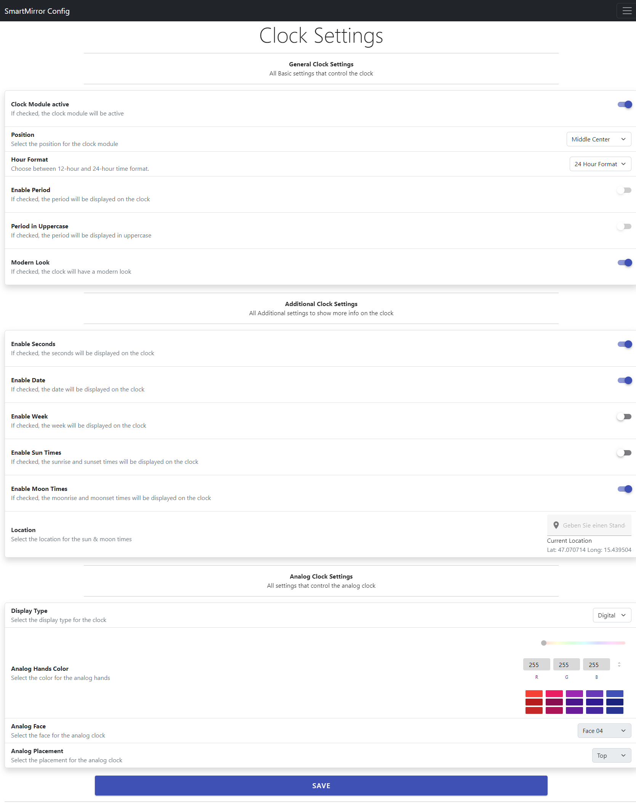

# MirrorConfig

A Vue 3 project for configuring MagicMirror 2. This project is still in development and is not ready for production use.

This project uses: 
- [Vue 3](https://vuejs.org/)
- [Vue Router](https://router.vuejs.org/)
- [Vue I18n](https://vue-i18n.intlify.dev/)
- [Boostrap 5](https://getbootstrap.com/)
- [Vuetify 3 Beta](https://next.vuetifyjs.com/en/) 
- [Vue-Google-Maps-Community-Fork](https://github.com/NathanAP/vue-google-maps-community-fork)

Boostrap 5 will be removed in later Versions and will be replaced with Vuetify 3 as soon as Vuetify 3 leaves Beta.

The API which is used to save the config file for MagicMirror 2 is a NodeJs & ExpressJs project which is not included in this repository. You can find the API [here](https://github.com/ProxyBlack61/MirrorConfigBackend)
## Customize configuration

See [Vite Configuration Reference](https://vitejs.dev/config/).

## Project Setup
To add full functionality to this project you need to create a new local file <mark>.env.local</mark>   and add the following lines to it: 
```sh
VITE_GOOGLE_PLACES_API=<YOUR_GOOGLE_PLACES_API_KEY>
```
### Install NPM dependencies

```sh
npm install
```

### Compile and Hot-Reload for Development

```sh
npm run dev
```

### Compile and Minify for Production

```sh
npm run build
```

### Lint with [ESLint](https://eslint.org/)

```sh
npm run lint
```

## Screenshots

*Clock Settings*


